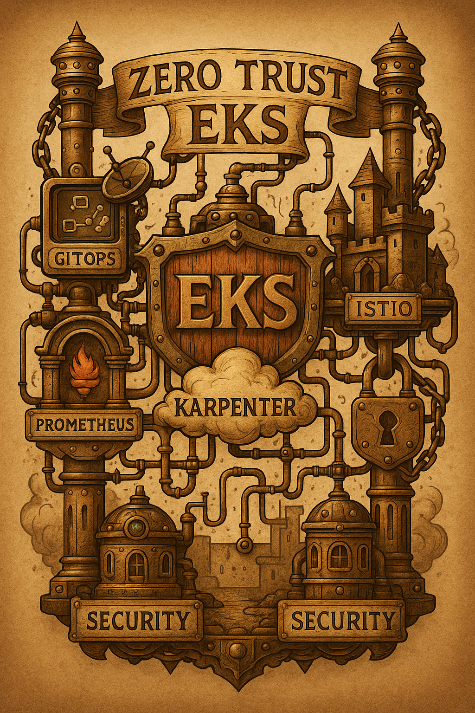
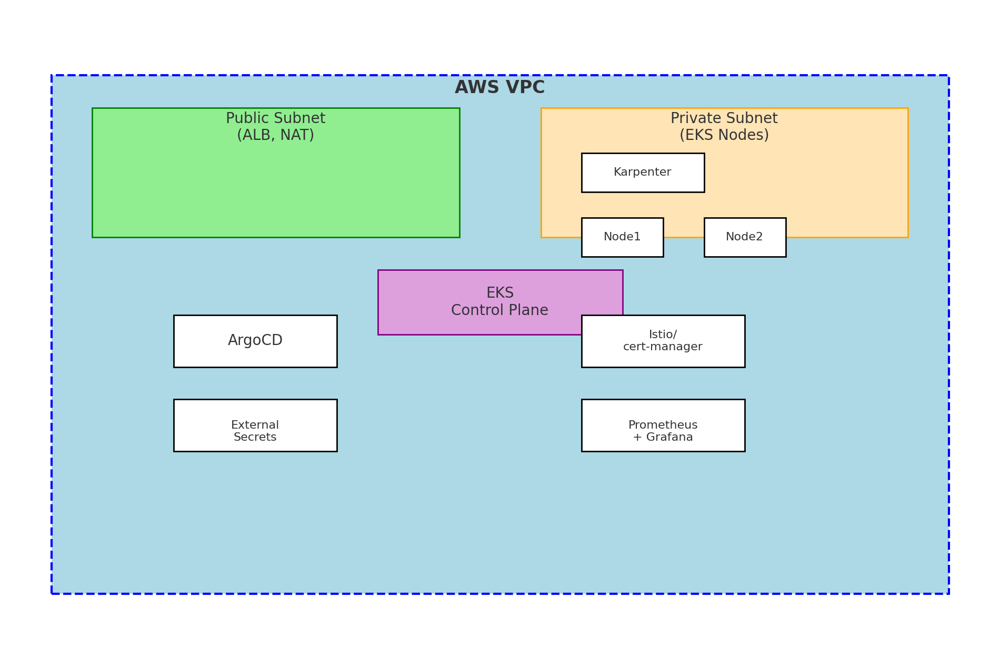

# EKS Zero Trust Blueprint 

A production-ready template for building a secure, scalable, and observable Amazon EKS infrastructure.

  

## What is Zero Trust and Why This Name?

This project is called "EKS Zero Trust Blueprint" because it implements a Zero Trust architecture for Kubernetes clusters in Amazon EKS.

Zero Trust is a security approach based on the principle "trust no one, verify everything". In the traditional security model, if you're inside the network - you're trusted. In the Zero Trust model - there is no trust by default, even if you're inside the network.

In this project, Zero Trust is implemented through the following components:

1. Network Policies - security rules that control who can communicate with whom inside the cluster
2. IAM roles and IRSA (IAM Roles for Service Accounts) - precise access rights configuration for each service
3. TLS with cert-manager or Istio - encryption of all traffic between services
4. Integration with AWS Secrets Manager for secure secrets storage

The project provides a ready-to-use template for deploying secure EKS infrastructure with modules for VPC, cluster security, autoscaling, GitOps, and monitoring - all built with Zero Trust principles in mind, meaning no default trust and explicit configuration of all permissions and communications.

## Features

- Zero Trust security: Network Policies, IAM roles, IRSA, TLS with cert-manager or Istio
- Karpenter autoscaling with ARM/Graviton node support
- GitOps with ArgoCD or FluxCD (selectable)
- Monitoring with Prometheus, Grafana, and Loki
- External Secrets integration with AWS Secrets Manager

## Modules

| Module        | Description                                             |
|---------------|---------------------------------------------------------|
| `vpc`         | AWS VPC with public/private subnets                    |
| `eks`         | EKS cluster, node groups, and IRSA setup               |
| `karpenter`   | Karpenter controller and provisioners                  |
| `gitops`      | ArgoCD or FluxCD installation and apps                 |
| `security`    | cert-manager or Istio, NetworkPolicies                 |
| `workloads`   | Example secure workload with NetworkPolicy + IRSA      |
| `monitoring`  | Prometheus, Grafana, Loki with Helm                    |

## Project Structure

```
.
├── terragrunt.hcl      # Кореневий конфіг
├── region.hcl          # Налаштування регіону
├── infrastructure/     # Terraform модулі
│   ├── vpc/           # Мережева інфраструктура
│   ├── eks/           # Kubernetes кластер
│   ├── karpenter/     # Автоскейлінг нод
│   └── state-storage/ # S3 + DynamoDB для стейту
└── env/               # Середовища
    └── dev/          # Dev середовище
        ├── terragrunt.hcl  # Конфіг середовища
        ├── vpc/
        ├── eks/
        ├── karpenter/
        └── state-storage/
```

## Getting Started

### Prerequisites
- Terraform >= 1.5
- Terragrunt >= 0.45
- AWS CLI configured
- kubectl & helm

### Deployment

### 1. Підготовка інфраструктури для стейту

```bash
# Створюємо S3 бакет і DynamoDB таблицю для стейту
cd env/dev/state-storage
DISABLE_INIT=true terragrunt init
DISABLE_INIT=true terragrunt apply
```

### 2. Розгортання інфраструктури

Варіант 1: Розгортання всього одразу
```bash
cd env/dev
terragrunt run-all init
terragrunt run-all plan
terragrunt run-all apply
```

Варіант 2: Розгортання по модулях
```bash
# VPC
cd env/dev/vpc
terragrunt init
terragrunt apply

# EKS
cd ../eks
terragrunt init
terragrunt apply

# Karpenter
cd ../karpenter
terragrunt init
terragrunt apply
```

### 3. Перевірка розгортання

```bash
# Отримуємо kubeconfig для кластера
aws eks update-kubeconfig --name eks-zero-trust-dev --region us-west-2

# Перевіряємо ноди
kubectl get nodes

# Перевіряємо поди
kubectl get pods -A
```

### 4. Видалення інфраструктури

```bash
# Видаляємо всі ресурси
cd env/dev
terragrunt run-all destroy

# В кінці видаляємо інфраструктуру для стейту
cd state-storage
DISABLE_INIT=true terragrunt destroy
```

#### Manual Deployment

Set the GitOps engine you want to install (`argocd` or `fluxcd`) in your Terraform variables:

```hcl
variable "gitops_engine" {
  description = "GitOps tool to install (argocd or fluxcd)"
  type        = string
  default     = "argocd"
}
```

Then deploy:

```bash
cd terraform/vpc && terraform apply
cd ../eks && terraform apply
cd ../karpenter && terraform apply
cd ../gitops && terraform apply -var="gitops_engine=argocd"
cd ../security && terraform apply
cd ../monitoring && terraform apply
cd ../workloads && terraform apply
kubectl apply -f app.yaml
kubectl apply -f external-secret.yaml
```

## Architecture



## Roadmap

- [x] Secure VPC & EKS baseline
- [x] IRSA & Karpenter
- [x] ArgoCD & FluxCD toggle
- [ ] Add IAM Permissions Boundary
- [x] Examples: Secure workloads + GitOps delivery
- [x] Monitoring stack (Prometheus + Grafana)

##  License

MIT License

---